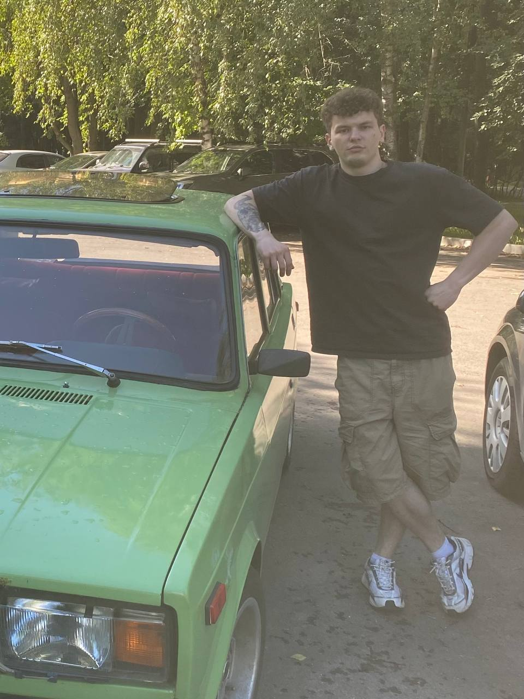
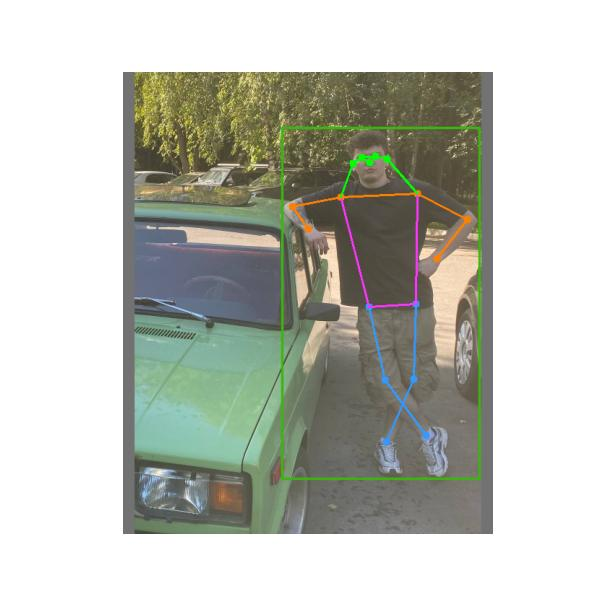

# VSP_YOLOv7_pose

# Human Pose Detection with YOLOv7-Pose

Проект реализует систему определения позы человека на изображениях с использованием модели YOLOv7-Pose.

Модель выполняет детекцию человека и определяет ключевые точки тела, после чего строит скелетную модель.

## Функциональность

- Детекция человека на изображении
- Определение 17 ключевых точек тела (keypoints)
- Построение скелета человека
- Визуализация результатов

## Используемые технологии

- Python
- PyTorch
- YOLOv7-Pose
- OpenCV

## Пример работы

Исходное изображение:


Результат детекции позы:


## Установка

Клонировать репозиторий:

```bash
! git clone https://github.com/WongKinYiu/yolov7.git
%cd yolov7
!pip install -r requirements.txt

#Установка весов
import requests
WEIGHTS_URL = 'https://github.com/WongKinYiu/yolov7/releases/download/v0.1/yolov7-w6-pose.pt'
open(yolov7_pose_url, "wb").write(requests.get(WEIGHTS_URL).content)
